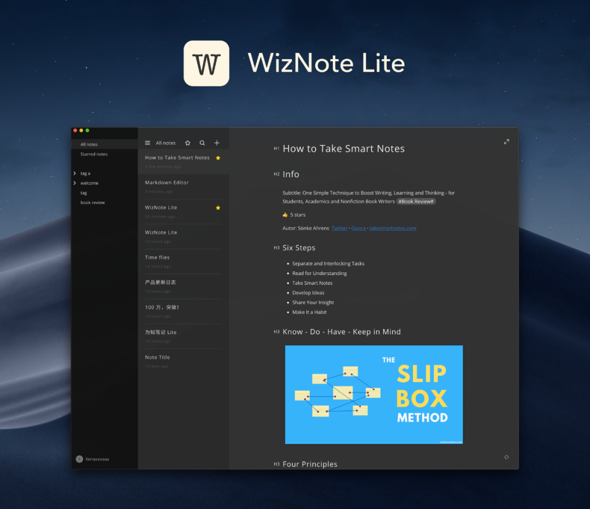
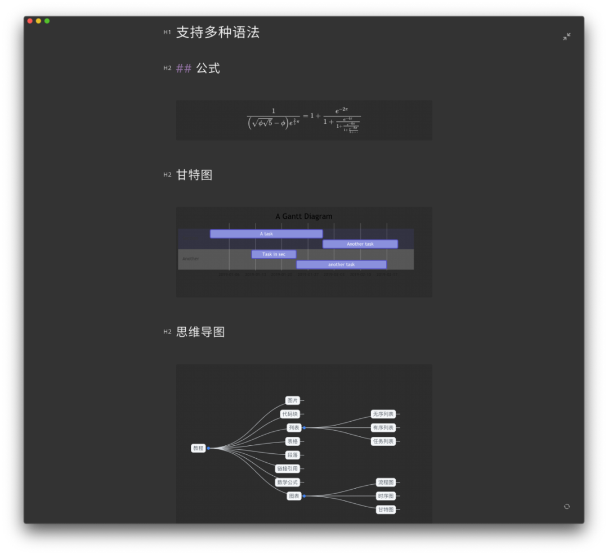
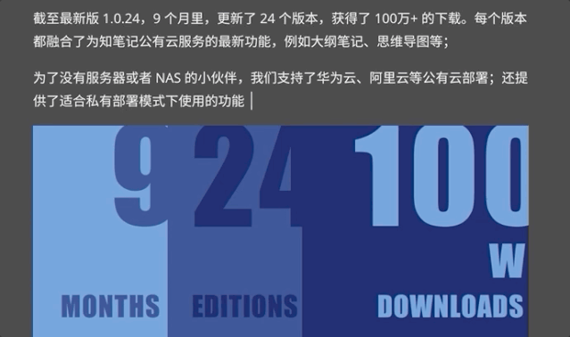
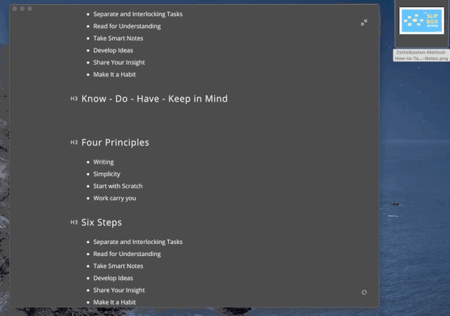
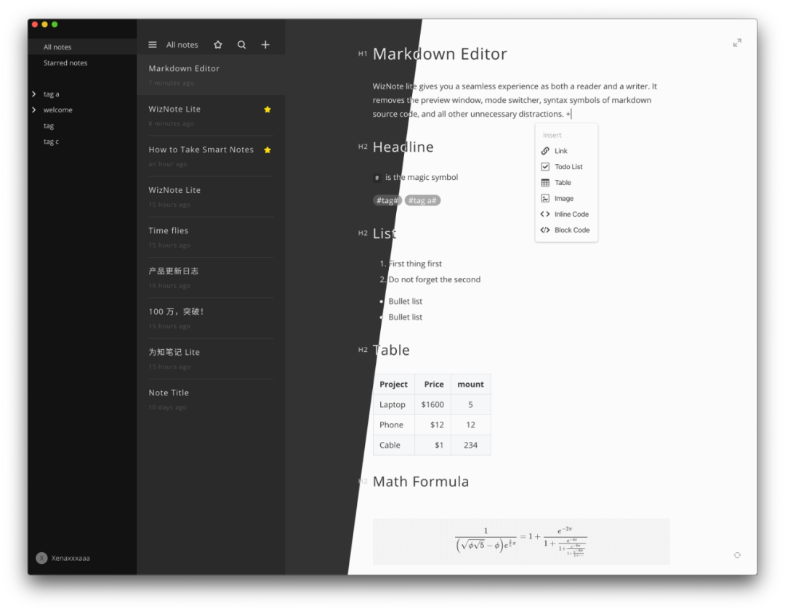

# WizNote Lite

## WizNote Lite 介绍

你的笔记里一定存满了各种「重要」的内容

网页收藏、微信公众号文章转发、文件导入……

但你的想法、创意和有价值的信息也被淹没

现在，WizNote Lite 来了

Markdown 实时预览，无压力书写；极简设计，呵护你的注意力

一个专注于写笔记的客户端，给你一个纯净的思考空间



### 实时预览 Markdown 编辑器

无需进入预览模式或分屏，输入 Markdown 语法后即可实时显示预览效果。摆脱一切干扰，让你的注意力全部集中在输入上。

### 支持多种语法

除标题、列表、待办清单等常用 Markdown 语法，还支持数学公式、代码高亮、甘特图、流程图、思维导图等



### 快捷添加菜单

输入 + 或 /, 在快捷菜单中可选择常用类型



### 无需图床

拖拽即可添加图片



正文输入 #tag# 可生成标签，输入#tag/sub tag# 可对应生成子标签，分类管理你的笔记

跟随系统（macOS / Windows 10）支持亮色与暗色模式



### 按需选择布局，给你想要的简单

如果你习惯使用标签管理，那么可以显示标签列表栏

如果你无需标签组织，只要通过搜索查找和星标来区分优先级，我们推荐双栏显示

如果你想要进入聚焦模式，那么就点击全屏，感受心无旁骛，开启创作心流吧


### 可本地离线使用，也可登录为知笔记账号上传数据

运行后可离线使用，数据保存在本地；亦可登录你的为知笔记账号，让笔记同步到一处

支持私有部署服务器，可登录 Docker 私有服务或为知盒子

[私有服务部署，Docker镜像](https://hub.docker.com/r/wiznote/wizserver)

## 开发环境设置

### 所需环境

1. node 8.0 或者更高
2. Windows / Mac / Linux

### clone 代码

```bash
git clone https://github.com/WizTeam/WizNoteLite.git
cd WizNoteLite
```

**注意**：windows下面cmd或者power shell，需要使用管理员身份运行

### 安装依赖

```bash
npm install -g foreman
npm install -g node-gyp
```

#### windows 依赖

1. 安装 [Python](https://www.python.org/)，并且把 Python.exe 的目录设置在系统的 Path 内
2. 安装 [nodejs-gyp](https://github.com/nodejs/node-gyp#on-windows), 并且按照操作安装组件(Cmd or PowerShell `run as Administrator`)

``` bash
npm install --global --production windows-build-tools
```

**注意**：该过程时间比较长，等待即可

### 初始化

```bash
npm install
```

#### 编译sqlite

#### 每次运行"npm install"后，也运行这条命令

参考: [使用 Node 原生模块](https://www.electronjs.org/docs/tutorial/using-native-node-modules)

```bash
./node_modules/.bin/electron ./tools/build_sqlite3
```

windows:

```bash
.\node_modules\.bin\electron ./tools/build_sqlite3
```

### 运行

``` bash
npm start
```

### debug

1. 在命令行执行`npm run react-start`
2. 点击VScode调试 (Debug Main Process)，可以调试main process
3. 调试renderer process，直接用浏览器即可

### package

```bash
npm run pack
```

## License

[MIT or commercial.](./LICENSE.txt)

## TODO
