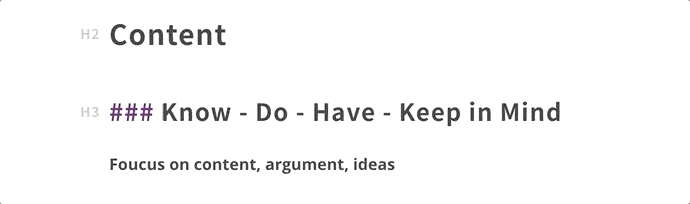
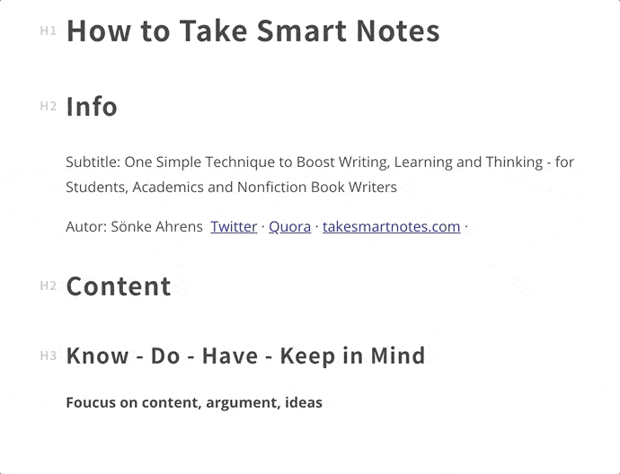
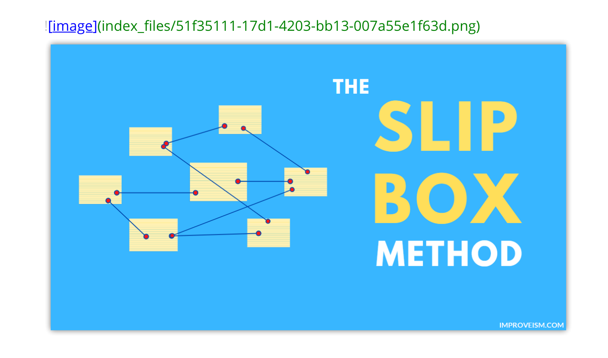
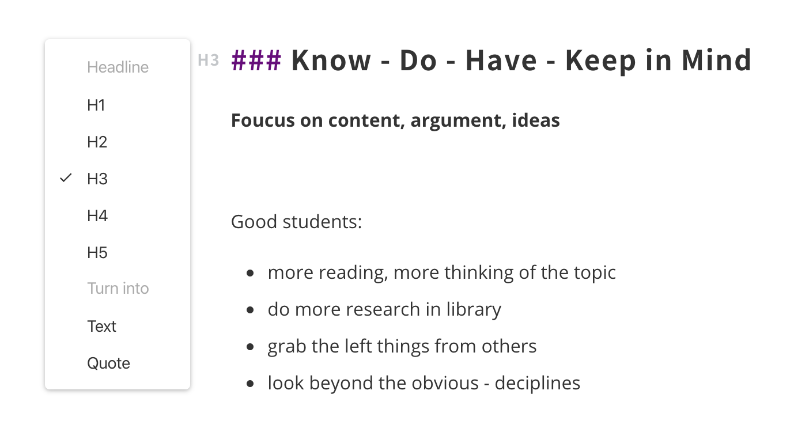
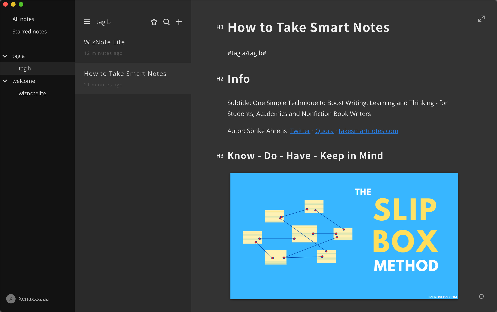

# WizNote Lite

#Welcome/WizNote Lite#

WizNote Lite is a simple markdown editor that gives you seamless experience in writing. You could log in through a WizNote account, the notes you created on Lite will also save in your WizNote account.

## Markdown Reader and Writer

### Live Preview

### Input Symbol + to Choose to Insert

### Say Goodbye to Image Hosting Service

### Convert Headline Level

## Tag System
Input #tag a#, it will generate a tag automatically, also support sub tag by inputting slash like #tag a/tag b#

