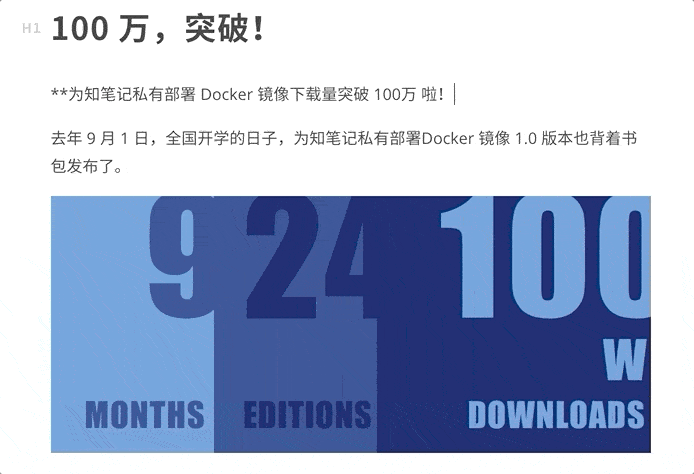
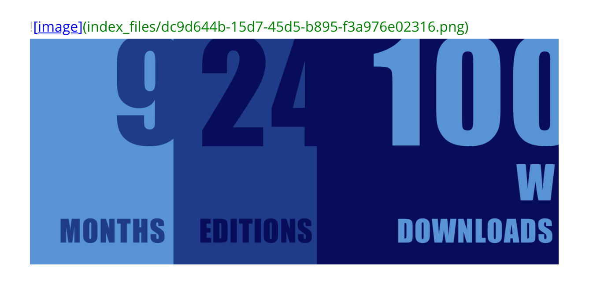
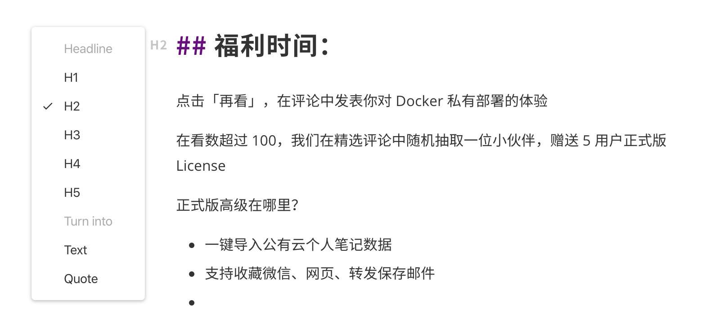
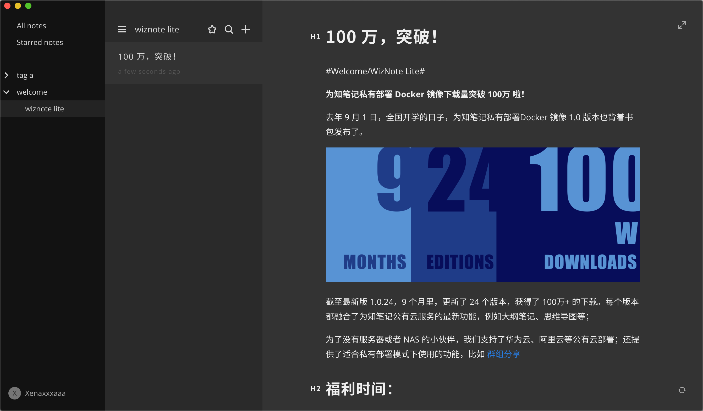

# WizNote Lite

#Welcome/WizNote Lite#

这是一个轻量的 Markdown 编辑器，帮助你安静地书写和创作。你可以使用为知笔记账号登录，在 Lite 中创建的笔记，也会显示在为知笔记里。

## Markdown 编辑器

### 采用即时渲染模式

### 输入 + ，选择插入的语法

### 无需图床，直接插入图片

### 点击 Hx ，切换标题层级

## 标签分类

输入 #tag a# ，可自动生成标签分类
输入 #tag a/tag b# ，可生成子标签

